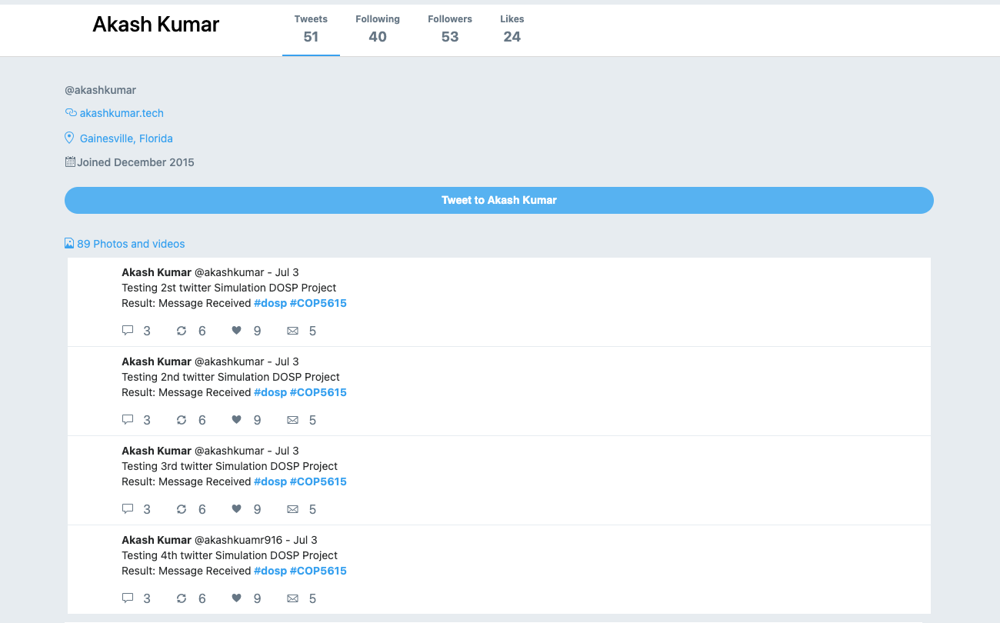

# twitter-clone-websocket

Authors:
Akash Kumar - (80024442) 
Ayush Kumar - (54666085)

-------------------------------------------------------
COP5615 : DISTRIBUTED SYSTEMS - TWITTER CLONE
-------------------------------------------------------
Use WebSharper web framework to implement a WebSocket interface to your part I implementation. That means that, even though the Erlang implementation (Part I) you could use AKKA messaging to allow client-server implementation, you now need to design and use a proper WebSocket interface. Specifically:

You need to design a JSON based API that  represents all messages and their replies (including errors)
You need to re-write parts of your engine using WebSharper to implement the WebSocket interface
You need to re-write parts of your client to use WebSockets.

# Implementation

We have implemented a Twitter clone (tweeter) and implemented the WebSocket interface using Chicago Boss. As well as storing the tweet data, we have a primary server. 
This project includes the same user functionalities as the previous project, including login, registration, tweets, retweets, subscribes, mentions, and hashtags. 
<pre>
Sample Output:
Server:
{ref:"1",payload:{response:"tweeter:userAkash has tweeted Testing 1st twitter Simulation DOSP Project Result: Message Received #dosp #COP5615 @akashkumar"},HashTag:{"dosp","#COP5615"}, Mention:" ", event:"tweet"}
{ref:"1",payload:{response:"tweeter:userAkash has tweeted Testing 2nd twitter Simulation DOSP Project Result: Message Received #dosp #COP5615 @akashkumar"},HashTag:{"dosp","#COP5615"}, Mention:" ", event:"tweet"}
{ref:"1",payload:{response:"tweeter:userAkash has tweeted Testing 3rd twitter Simulation DOSP Project Result: Message Received #dosp #COP5615 @akashkumar"},HashTag:{"dosp","#COP5615"}, Mention:" ", event:"tweet"}
{"ref":"1","payload":{" response":"tweeter:userAyush subscribed to @akashkumar"},"HashTag":"", Mention:””, "event":"subs "}
{"ref":"1","payload":{"response":"tweeter:userAyush has re-tweeted "Testing retweet twitter Simulation DOSP Project #dosp #COP5615 @ayush"},"HashTag":{"dosp",”#COP5615”}, Mention:””, "event":"re-tweet"}

</pre>
# Web UI
We Also, implement the UI using react JS and use APIs to retrieve tweets, retweets, subscribers, followings, and likes, as well as some static content, 
such as people's recommendations to follow.
 
</img>
